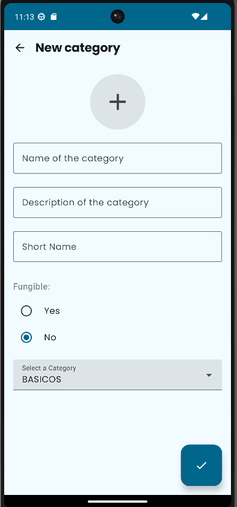

# Katherine_Johnson

## Descripción
Este proyecto es una aplicación móvil para gestionar el inventario de productos, permitiendo a los usuarios agregar, eliminar y modificar artículos con facilidad.

## Autores

- Daniel Cortés Sánchez
- Leandro Orellana Martos
- Sergio Aguilera Ibarra
- 

----------------
## Caracteristica Producto
Esta caracteristica está siendo implementada por Sergio.
Un producto es un objeto físico que será parte de un "Inventario",
un producto puede ser cualquier cosa (coches, productos de limpieza,
alimentos...).

### ¿Qué se ha hecho?
Se ha implementado de forma general:
- Una clase producto.
- Una pantalla para ver el detalle de un producto.
- Una pantalla para la creación y edición de productos y sus correspondientes vista-modelo.
- Una pantalla para listar productos y su correspondiente vista-modelo.
- Un repositorio para obtener los productos almacenados en una infraestructura simulada.
- En comparación con la primera entrega se ha traducido el código fuente al ingles.
- Implementar, junto con la base de la navegación entre pantallas para el proyecto, una navegación
  hacia las pantallas de listar y creación de productos.
- Pantallas de carga para las pantallas de creación, edición y lista de productos mientras se accede a
  los repositorios correspondientes.

### Detalles a tener en cuenta
El modelo de Productos solo guarda una Sección en un campo, sin embargo en las pantallas de edición y creación de productos,
se podrá seleccionar la dependencia en un campo, este campo solo actua de filtro de sección, no es guardado directamente.

 


----------------
## Categorias
Esta característica ha sido implementada por **Daniel Cortés Sánchez**. La funcionalidad permite gestionar las categorías de productos dentro de la aplicación, con dos pantallas principales: una para la creación de nuevas categorías y otra para listar las categorías existentes.

### ¿Qué se ha hecho?
- **Pantalla para crear categorías**: Se ha implementado una interfaz de usuario para crear nuevas categorías de productos, que incluye campos para el nombre, descripción, nombre corto, tipo de categoría y si es fungible o no.
- **Pantalla para listar categorías**: Se ha creado una vista que lista todas las categorías existentes, permitiendo al usuario visualizar la información relevante de cada una.
- **Validación de campos**: Se ha implementado la validación de campos tanto en la creación de categorías como en la edición para evitar la duplicación de categorías y asegurar que se proporcionen datos correctos.
- **Gestión de estados y errores**: Se ha introducido un modelo de estado que maneja los errores en los campos de entrada y gestiona la creación de nuevas categorías.
- **Interacción con el repositorio**: Ambas pantallas interactúan con un repositorio simulado de categorías para almacenar y recuperar los datos.

### Detalles a tener en cuenta

#### Pantalla de creación de categoría:
- **Campos**: Los campos que se incluyen son:
    - Nombre de la categoría
    - Descripción de la categoría
    - Nombre corto
    - Imagen (aunque aún no implementada)
    - Tipo de categoría (con un desplegable para seleccionar entre las opciones disponibles)
    - Indicador de fungibilidad (si es fungible o no)

- **Validación**:
    - Se realiza una validación del nombre para asegurarse de que no esté vacío ni sea un duplicado.
    - La descripción también debe ser ingresada.
    - El nombre corto debe cumplir con una expresión regular y no puede duplicarse con otras categorías.

#### Pantalla de listado de categorías:
- **Lista de categorías**: La pantalla muestra una lista de las categorías disponibles con un ícono y el nombre de cada una. Cada categoría puede ser seleccionada (aunque la funcionalidad de detalle aún está pendiente de implementación).

- **Botón de acción flotante**: Se ha añadido un botón flotante que permite navegar a la pantalla de creación de nuevas categorías.


 

----------------
## Inventarios
Caracteristica implementada por **Leandro Orellana Martos**. La funcionalidad permite gestionar inventarios de forma fácil al usuario, acompañado de tres pantallas como son la de listado de inventarios, detalles de inventario y creacion de inventario.

### ¿Qué se ha hecho?
- **Pantalla para crear inventarios**: Se ha implementado una interfaz de usuario para crear inventarios de productos, el cual tiene dos campos como son el nombre y la descripcion.
- **Pantalla para listar inventarios**: Se ha creado una vista que lista todos las inventarios existentes, en la cual el usuario podra listar todos los inventarios existentes y nuevamente creados.
- **Tarjetas con iconos de editar y borrar**: Se han implementado las funcionalidades de editar y borrar inventarios (aún en desarrollo)
- **Gestión de estados y errores**: Se ha introducido un modelo de estado que maneja los errores en los campos de entrada y gestiona la creación de nuevos inventarios.
- **Interacción con el repositorio**: Todas las pantallas están unidas al repositorio, lo cual indica que sacan y meten datos de forma local.

### Detalles a tener en cuenta

#### Pantalla de creación de inventario:
- **Campos**: Los campos que se incluyen son:
    - Nombre del inventario
    - Descripción del inventario
#### Pantalla de detalles de inventario
- Incluye productos de forma falsa (ya incluidos en repositorio) para simular funcionalidad de listado de productos en inventario
- Nombre y descripción de los productos
- Nombre y descripcion del inventario
#### Pantalla de listado de inventario
- Cards con funcionalidades de edicion y eliminamiento de inventarios


 

-----------------
## Para tener en consideración
Para poder usar animaciones Lottie y guardado de imagenes se han usado las siguientes librerias:

```
compose-coil = "2.5.0"
compose-coil = {group= "io.coil-kt", name = "coil-compose", version.ref="compose-coil"}

lottieAnimations = "6.1.0"
animation-lottie = {group="com.airbnb.android", name="lottie-compose", version.ref="lottieAnimations"}
```
